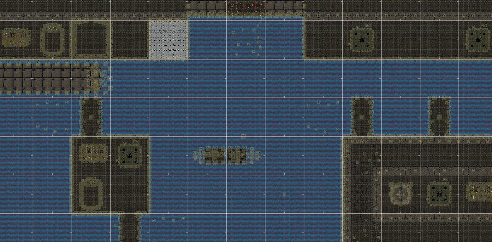
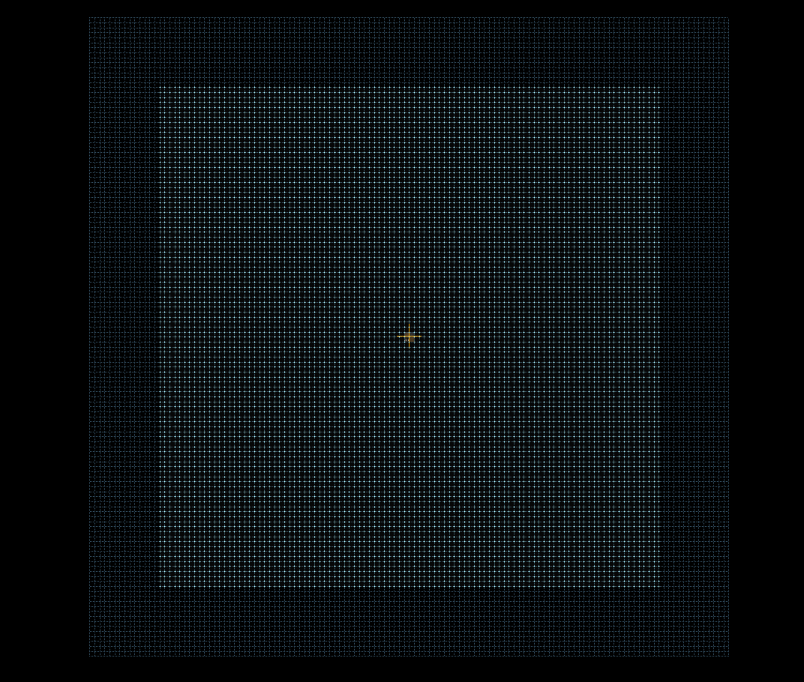
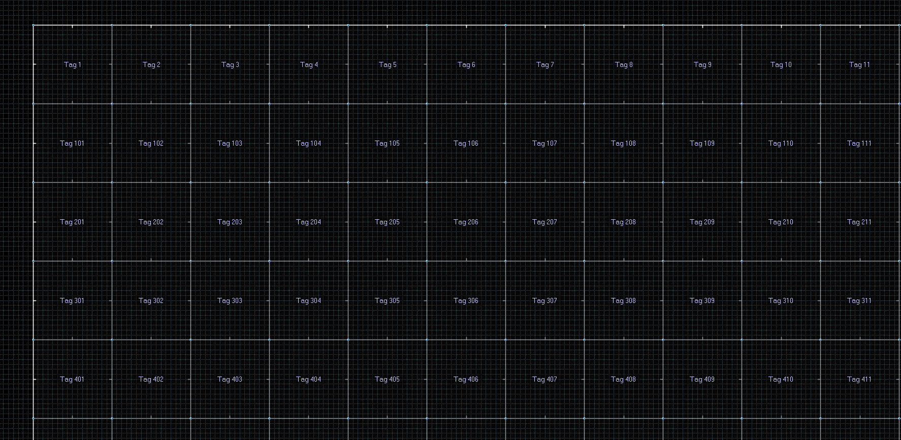
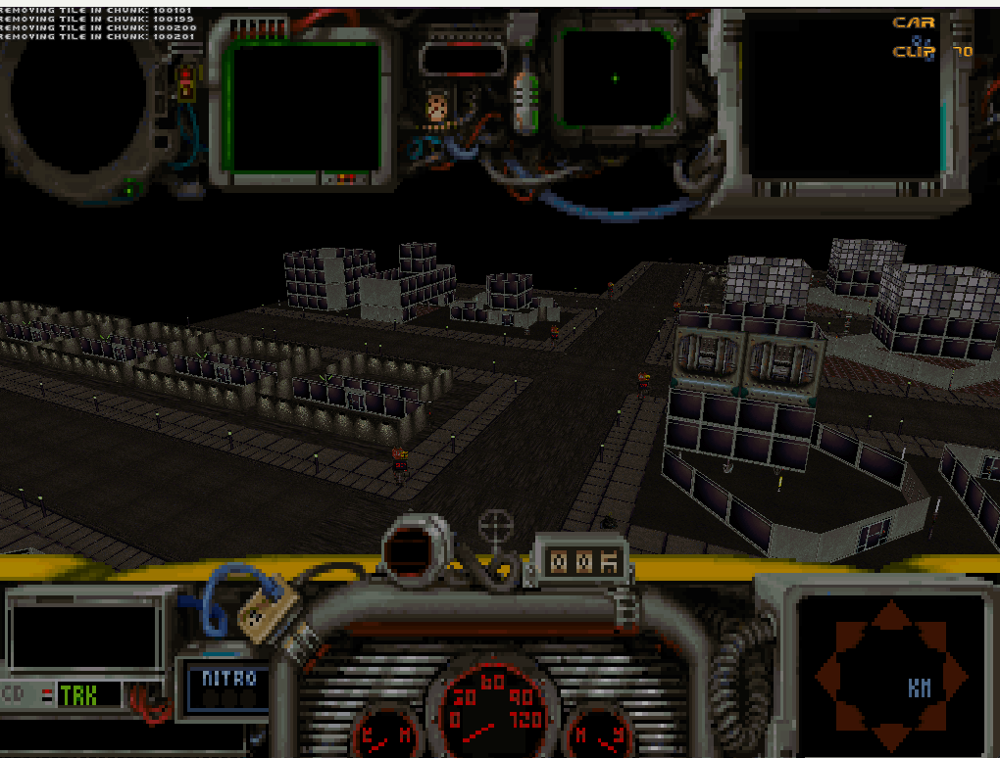
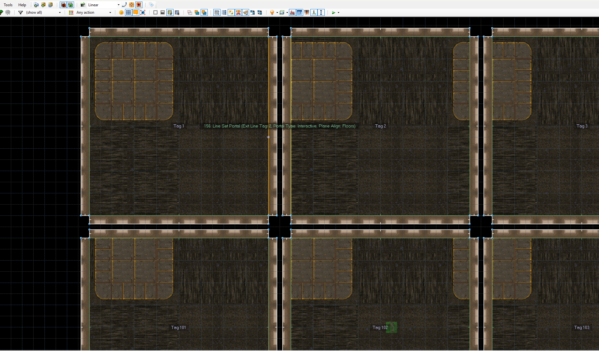
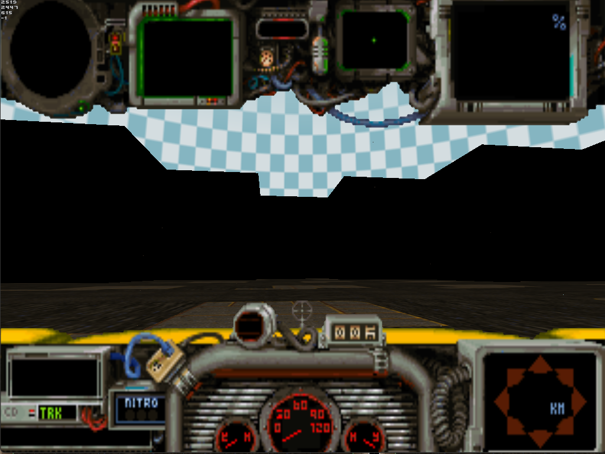

# Explanation about the methods for handling maps

*Below is an explanation about the methods I see for handling the maps, as I had some questions regarding the reasoning for my approach. I will add some screenshots to better explain some of the points.*

I made two setups for showing a map, but there are definitely more ways to skin the cat and I'm not saying I did it the right way, but I want to give my reasoning. I will try and explain these here, and list the positives and negatives for each. I am very open to suggestions and happy to be corrected on any of the points if I am incorrect about these.

**Note:** In Quarantine the floors are built on the fly too, so instead of a solid plane for the floor, every texture component of the floor is its own component. Trying to get this working in Doom was taking up way too many sectors, so I generated completed tile textures in advance and applied these a tile at a time. I am not going to cover that in the below, but thought best to mention (as it is possible to know which road textures connect to each other for pathing etc).

## Initial explanation
- The Quarantine maps are Huge. An example map has around 12,000 tiles (so like each tile being a road, or some houses etc). For each map there are 128 of these model setups, but each of these has 4 different texture sets, so we are talking 512 different setups.
- The way that Quarantine handles the walls are that it will have multiple horizontal walls at different heights and angles. These walls can be subdivided horizontally, and you can zoom will tile vertically. The wall cannot be subdivided vertically (there would just be another wall higher up).
- The textures are taken from a pool of textures for that specific level, but the orders can be different. The alternate texture maps are not a direct 1:1 with another set of textures, so texture set 1 might be "1-1,4-2,2-3" but the next one "2-2,2-2,2-2".
- Quarantine has floating walls and floating floors. Doom can handle floating walls with midtextures, but not natively floors unless they are done as models or special "3d floors".
- Doom models do not have collision, or rather they do, but not based on the linedef. You specify a radius and height, and it does that at the anchor point of the model.

My understanding of the Original_Game is that for a wall to block engine line of sight (and cull the visibility of sectors behind it) the wall needs to go from floor to ceiling. They are not blocked by midtextures, they are not blocked by 3d models, afaik they are not blocked by sector walls that don't go to the ceiling. This means that tall buildings in front of the player also don't block it.

The exception to this is when you bring down the ceiling to the top of the building. That will block it, however this messes up the sight of the buildings behind it. [example image]

## 3D Model Based Walls

### Individual texture actors, full map at once
Each texture being an actor (so think a Doom creature or decoration). This has a 3D model (a single texture tile) as the sprite image. I then have the collision set to a radius of half of the model width. I just have the one model which can be loaded with each of the textures. I can scale it horizontally and vertically.

**Advantages:**
- I can use a limited pool of textures as you are spawning each wall section in dynamically
- This setup can load any custom maps, as the wall textures don't need to be pre-compiled
- Additional wall textures can be added in for modding and, again, don't need pre-compiling
- The collision is handled automatically as it is using the built in actor collision
- There's no issue with floating walls, or stacked walls
- I already have the code for this...

**Disadvantages:**
- This is sloooow for large maps if all tiles are done at once. Take a sample tile like the straight roads - they have 4 walls of 8 tiles [image]. That's 32 models. When you start multiplying that by 12,000 it is just way too much
- This is a pretty ridiculous way to do things

### Individual texture actors, Dynamic loading of tiles
This is the current setup that I use. This works by dynamically loading in the corresponding tiles around the player based on distance.

**Advantages:**
- This gives the advantages of the full map individual texture actors, whilst keeping the performance running ok due to not loading the whole map at once
- The walls can be spawned in and removed in game. This means that you can switch between maps on the fly, or randomize maps

**Disadvantages:**
- View distance "popping" style effect as Doom spawns in the distant tiles
- Wouldn't work great for multiplayer (or you could see where the enemy is by seeing distant tiles popping in)

### Individual texture actors, Dynamic loading of tiles, full tile models
This was a suggested way of doing it. Basically the same setup as the other two model based walls, however instead of each model being a single texture, each model contains all of the walls for that whole tile.

**Advantages:**
- This gives the advantages of the full map individual texture actors, whilst keeping the performance running ok due to not loading the whole map at once
- The models can be spawned in and removed in game. This means that you can POTENTIALLY switch between maps on the fly, and or randomize maps, with large caveats - see notes about collision
- Much fewer actors, so less for the game to need to render
- Sped up script as you aren't needing to add and remove as many actors

**Disadvantages:**
- View distance "popping" style effect as Doom spawns in the distant tiles (though probably less than with the the single texture setup as you can do more at once)
- Wouldn't work great for multiplayer (or you could see where the enemy is by seeing distant tiles popping in)
-  Each model would need 4 sets of textures (or you would need 4 of each). That's a lot of redundant images in the textures unless you can generate an array of all of the images in one image then map each UV to part of it. Not sure if Doom allows for having multiple UV setups on one model
- No collision. This is a bit of a killer. You can't have collision for the whole wall when it is just the centre that has a radius based collision. This would have to be done with in game invisible linedefs. This stops you from being able to do anything dynamic as the collision wouldn't match the models any more
- The caveat to this is that you could do something that I burnt out on trying to get working with DoomZ years ago, namely pre-defined invisible linedefs in every possible layout for every possible tile, [DoomZ tile based system](https://youtu.be/48xjEe2bXfw)
 that can be turned on and off. Every square would need to have every possible configuration layout, and they need to be togglable. In GZDoom you can multi-tag linedefs, so you can assign multiple different ids to each line. This means that lines shared between layouts can still be group tagged to that particular tile layout. Zandronum does not allow this. At any rate, I think this is a fool's errand as you are going to run out of linedef ids before you get to that point

## Sector Based Setups

*Setup using 1 texture per linedef. Basically mapping the linedef to a texture*
### Basic sectors
Basically just using the Doom sectors and raising the floor. So like [image]

**Advantages:**
- The "proper" way to do this 
- Would work fine for multiplayer
- Proper collision by default

**Disadvantages:**
- You can't have floors without in-game 3D floors which is fiddly, and separate models for these. Quarantine has lots of ceilings, and bottom of bridges etc
- The walls cannot be spawned in and removed in game. The full map would need to exist in advance
- You can't have 2 different textures above each other. If you have a 2 storey building then you are either going to need to offset the edge very slightly to bring up the wall above it [image]. The alternate is that you create textures for a full wall in advance. Either saving these as textures, or using texturedef to create them. As there are 512 different tiles per map, most with multiple walls, this is a lot of work, and you also lose the benefits of instanced textures as each texture is now larger, and also contains the same image data
- Still doesn't block the line of sight for the engine, so you're still rendering the huge map (with all of those textures) at once. I believe this will also be slow. I have not tested this on a map this large
- You no longer have each tile be a single square sector. It is now split up into lots of smaller sectors as you add the buildings

### Basic sectors with the ceiling lowered to the top of the buildings
[image]

**Advantages:**
- Proper culling of sectors behind the image
- With a combination of upper texture and bottom texture you can now 
- Some limited ability to have "floating" stuff by bringing down the ceiling at this point
- You no longer have each tile be a single square sector. It is now split up into lots of smaller sectors as you add the buildings

**Disadvantages:**
- Cuts off the view of buildings behind the one you are doing this for
- Fiddlier to set up when you have to factor in lowering the ceilings around buildings and these bits need to be in surrounding tiles

## Midtexture Based Setups

### Midtextures

**Advantages:**
- Can be floating in the air
- Built in collision
- Can be assigned one by one, or you could use a combined texture for each wall as discussed above
- Can exist within a sector without splitting it, keeping it to one sector per tile

**Disadvantages:**
- View distance "popping" style effect as Doom spawns in the distant tiles
- Wouldn't work great for multiplayer (or you could see where the enemy is by seeing distant tiles popping in)
- No way of having floors above floors by default (would need to combine with models or 3D floors)
- All walls still need to be assigned in advance. This means no dynamic maps, and no randomized maps
- Midtextures do not block the engine line of sight, so you're still seeing the full map in advance
- Can't "stack" on top of each other as such (you can't have 2 midtextures on a single linedef. You would have to make the wall above be slightly offset (which is a pain when they would then fall into the next tile's sector)

## Any of the above, but with portals

This was a test that I did to separate every sector by a small space, and then use GZdoom linedef portals to dynamically link and unlink tile linedefs so that you could create your own culling distance

**Advantages:**
- culling distance means that you aren't viewing the full map at once

**Disadvantages:**
- This did not work very well. Portals were randomly failing to work on occasion, and the game enforces a set limit to the number of hops through portals that you can see, replacing it with black if this limit is hit. You therefore lose the city backdrop. The number of hops cannot be altered as this is part of the engine.
- the offset for the gaps really messes with my tracking scripts for which tile you are in (could be fixed) and also messes with the floors as they no longer map to the right xy coordinates so you'd need to calculate this for each tile and apply the offset

